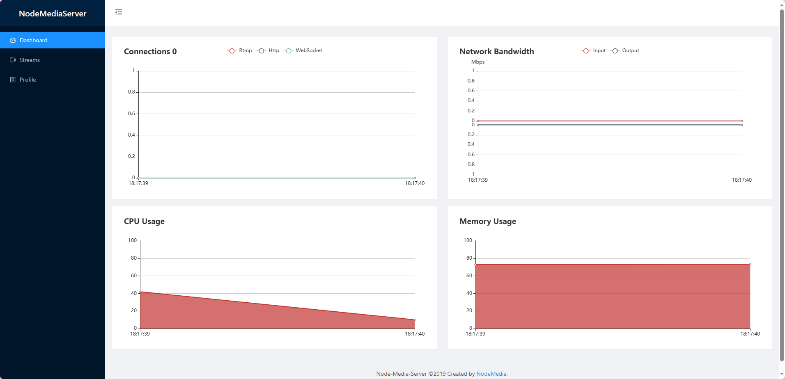
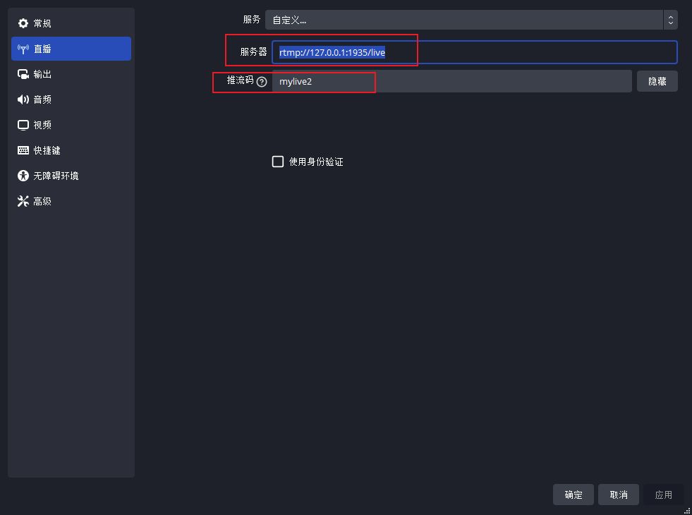
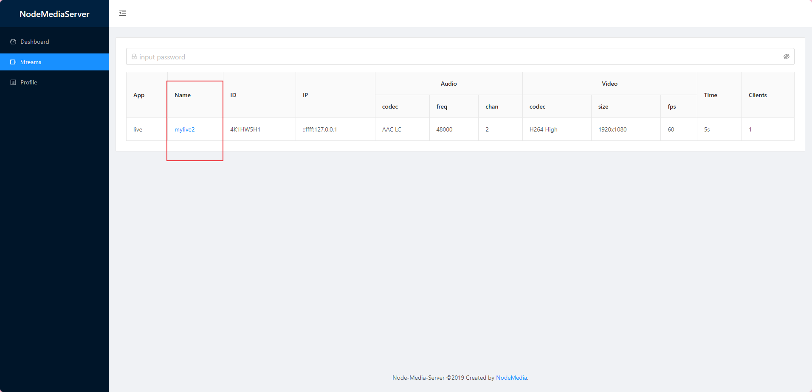

# NestJS搭建直播服务器 🐱‍🏍🐱‍🏍🐱‍🏍

### 介绍

后端使用`node-media-server`搭建直播推流服务器,使用`obs`推流,前端可使用B站开源的`flv.js`来播放直播,React可使用`react-player`播放。

### 一、实现原理

- 通过 [`node-media-server`搭建后台服务器](#nodeServe)会生成推流地址和管理端地址
- 使用[`obs`开启直播](#obs)将直播流推送到后台服务器
- 后台服务器对流进行加密、缓存、增加多个清晰度等等
- 前端通过 [`flv.js`播放](#flv)直播

### 二、node-media-server<a id="nodeServe"></a> 搭建直播流服务器

   `node-media-server`是基于`node.Js`开发的一个推流服务器。GitHub地址 ☞ [node-media-server](https://github.com/illuspas/Node-Media-Server)

- 下载`node-media-server` 和`@ffmpeg-installer/ffmpeg`(对流进行处理需要用到这个工具)推荐使用`pnpm`

  ```bash
  pnpm i node-media-server @ffmpeg-installer/ffmpeg
  ```

- 新建一个`live.js`文件

  ```js
  import NodeMediaServer from 'node-media-server'
  const createStream = () => {
     // 流最基础的配置文件
     const config = {
        rtmp: {
          port: 1935, // 推流端口
          chunk_size: 60000,
          gop_cache: true,
          ping: 30,
          ping_timeout: 60,
        },
        http: {
          port: 8887, // 获取流的地址
          allow_origin: '*',
        }
      }
      const avv = new NodeMediaServer(config)
      avv.run()
  }
  
  createStream()
  ```

- 执行该文件 `node live.js` 控制台会打印如下则证明服务器启动成功

  ```bash
  Node Media Server v2.6.2
  Node Media Rtmp Server started on port: 1935
  Node Media Http Server started on port: 8887
  Node Media WebSocket Server started on port: 8887
  ```

- 在浏览器中访问`127.0.0.1:8887/admin` 可访问服务器管理端地址。[这里可查看更多api](https://github.com/illuspas/Node-Media-Server/blob/master/README_CN.md#服务器信息统计)

  


### 三、使用obs软件进行直播推流

- 下载`obs` 这里以[windows](https://obsproject.com/zh-cn/)版作为演示

- 下载完成后依此点击 设置 => 直播  设置推流地址为 `rtmp://127.0.0.1:1935/live` live为app名称可自行替换,推流码也可自行替换

  

- 上面我们设置了app名称为`live`,推流码为`mylive2`,然后开启直播并打开`127.0.0.1:8887/admin` 管理端地址(记得刷新页面~),可以看到直播参数,可以点击`mylive2`来预览直播

  


### 四、使用<a id="nodeServe"></a>flv.js播放

-  注意地址由app名称`live`加name`mylive2`组成

```html
<script src="https://cdn.bootcss.com/flv.js/1.5.0/flv.min.js"></script>
<video id="videoElement"></video>
<script>
    if (flvjs.isSupported()) {
        var videoElement = document.getElementById('videoElement');
        var flvPlayer = flvjs.createPlayer({
            type: 'flv',
            url: 'http://localhost:8887/live/mylive2.flv'   
        });
        flvPlayer.attachMediaElement(videoElement);
        flvPlayer.load();
        flvPlayer.play();
    }
</script>
```

### 五、对视频流进行处理(高级操作)

- 浏览器访问`http://localhost:8887/live/mylive2.flv`后可以直接获取流这样并不安全,通常我们会对`url`进行加密 [node-media-server](https://github.com/illuspas/Node-Media-Server)该插件提供了方法,这里只介绍使用`m3u8`流来播放。
- 修改上面的`createStream`方法,使用`ffmpeg`来处理流,上面我们已经下载了。
- 完整配置如下

```js
const createStream = () => {
   // eslint-disable-next-line @typescript-eslint/no-var-requires   解决ts,eslint报错
   const ffmpegPath = require('@ffmpeg-installer/ffmpeg').path  // 获取ffmpeg工具地址
   // 流最基础的配置文件
   const config = {
      rtmp: {
        port: 1935, // 推流端口
        chunk_size: 60000,
        gop_cache: true,
        ping: 30,
        ping_timeout: 60,
      },
      http: {
        port: 8887, // 获取流的地址
        mediaroot: './media', // 经过处理的流都会放在这个目录下
        allow_origin: '*',
      },
      // 添加任务 输出两个不同分辨率的流
      fission: {
        ffmpeg: ffmpegPath,  // ffmpeg工具的地址,插件会调用ffmpeg来处理流
        tasks: [
          {
            rule: 'live/*',
            model: [
              {
                ab: '192k', // 音频码率
                vb: '10000k', // 视频码率
                vs: '1920x1080', // 决定了视频的分辨率
                vf: '60', // 刷新率60fps
              },
              {
                ab: '320k',
                vb: '20000k',
                vs: '2560x1440', // 决定了视频的分辨率 
                vf: '60',
              },
            ],
          },
        ],
      },
      //  输m3u8格式的视频  及将视频转为hls
      trans: {
        ffmpeg: ffmpegPath,
        tasks: [
          {
            app: 'live',
            hls: true,
            hlsFlags: '[hls_time=2:hls_list_size=3:hls_flags=delete_segments]',
            hlsKeep: true, // to prevent hls file delete after end the stream
            dash: true,
            dashFlags: '[f=dash:window_size=3:extra_window_size=5]',
            dashKeep: true // to prevent dash file delete after end the stream
          }
        ]
      }
    }
    const avv = new NodeMediaServer(config)
    avv.run()
}
```

- **配置`hls`后`ffmpeg` 会将处理的流放到`media`文件夹中,视频保存为以`.ts`为后缀的文件中其中`index.m3u8`决定了视频的播放顺序所以要通过`http://localhost:8887/live/mylive2/index.m3u8`来获取视频** 
