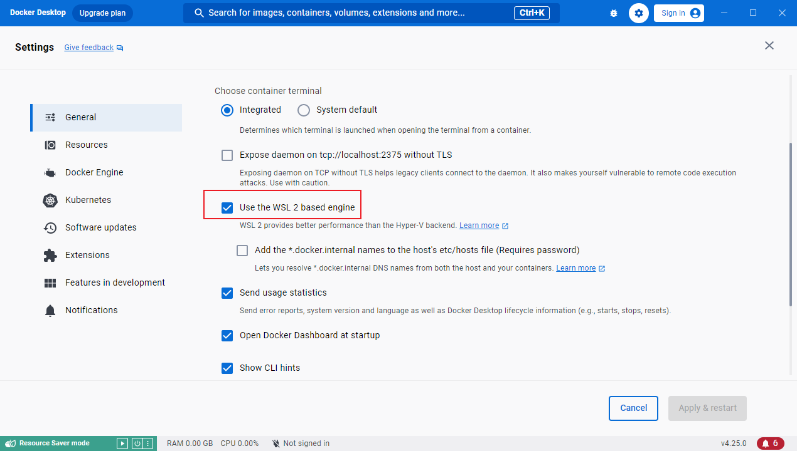
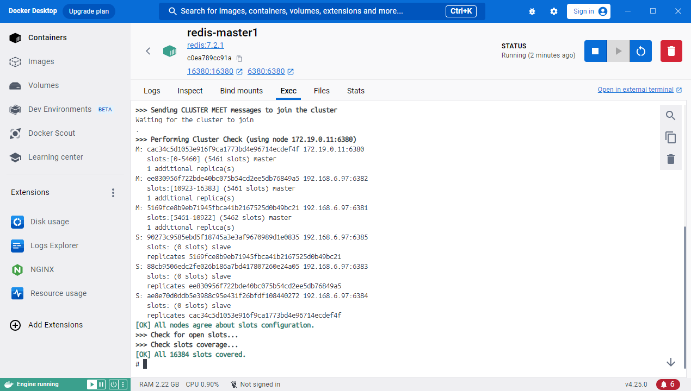
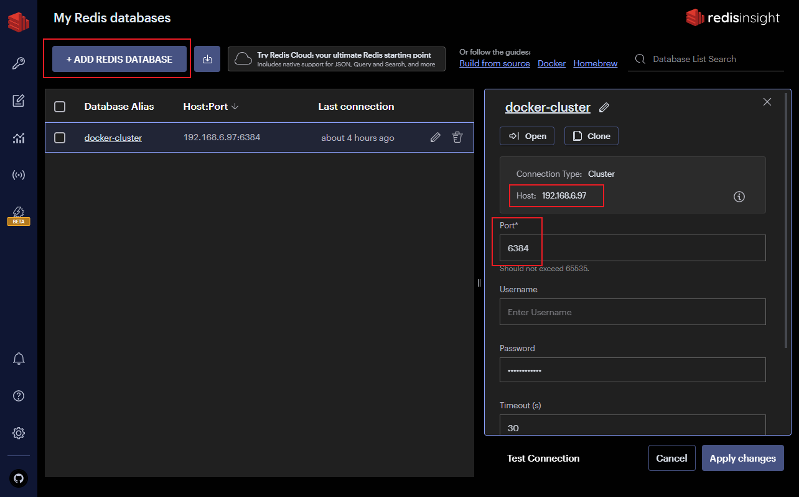

# Windows端使用Docker部署Redis集群 🐱‍🏍🐱‍🏍🐱‍🏍

### 介绍

本文介绍如何在Windows端使用Docker部署Redis集群(仅供学习Docker和Redis使用,如遇到问题可在评论区交流),对于Docker和Redis相关知识本文不做扩展可在各大论坛搜索资料学习~

### 一、实现原理

- 在`Windows`端下载[Docker Desktop](https://www.docker.com/products/docker-desktop/)
- 在`Windows`使用Docker需开启虚拟化`Hyper-v`或使用`WSL2`(这里不作扩展),对于不同版本的`Windows`也有些许不同下面会讲到
- 使用`docker-compose` 来一键安装并运行6个Redis实例(3主3重),通过配置redis.conf实现集群
- 在本机(宿主机)上使用`Redis`官方桌面工具设置Redis数据并验证集群是否正常工作
- 末尾附上源码地址

### 二、新建Redis配置文件

- 这里将6个`Redis`实例的监听端口分别设置为6380 ~ 6385

- **`cluster-announce-ip 192.168.6.97`  这里要设置成你宿主机的IP,因为当你在宿主机通过`某一个端口(6380)`连接集群查询数据时数据可能`并不在当前Redis实例上`所以集群会返回一个地址加端口并去重新查询,但是集群部署在docker中返回的是`docker内网的地址`,在本机是无法访问docker内网地址的,所以需要Redis返回本机的IP地址再通过Docker暴露的端口进行重定向查询**

- 还有一种通过设置docker的`host`模式,就是docker直接共享你宿主机的网络,这样就不存在内网问题了,但是`host`不支持`Docker Desktop for Windows`所以这里不做介绍(详情可查阅Docker官网)

- 完整配置如下开启`Redis-Cluster`和`AOF`持久化存储,创建`AOF`是需要文件的读写权限的,一般情况下`Docker`内部容器无权写入文件到宿主机(下面会讲到)

  ```yaml
  # 关闭保护模式
  protected-mode no
  
  # 设置端口号
  port 6385
  
  # 设置为守护进程
  daemonize no
  
  # 设置日志级别
  loglevel verbose
  
  # 设置日志文件 - 设置后log将不在控制台打印而是以文件形式保存
  logfile redis.log
  
  # 设置数据库数量
  databases 16
  
  # 是否总是显示logo
  always-show-logo yes
  
  # 设置保存数据库的频率
  save 900 1
  save 300 10
  save 60 10000
  
  # 如果在后台保存数据库时出错，是否停止写操作
  stop-writes-on-bgsave-error yes
  
  # 是否压缩rdb文件
  rdbcompression yes
  
  # 是否校验rdb文件
  rdbchecksum yes
  
  # rdb文件名
  dbfilename dump.rdb
  
  # 是否开启AOF
  appendonly yes
  
  # AOF文件名
  appendfilename "appendonly.aof"
  
  # AOF的fsync策略
  appendfsync everysec
  
  # AOF重写时是否执行fsync
  no-appendfsync-on-rewrite no
  
  # AOF重写的百分比阈值
  auto-aof-rewrite-percentage 100
  
  # AOF重写的最小大小
  auto-aof-rewrite-min-size 64mb
  
  # 是否加载截断的AOF文件
  aof-load-truncated yes
  
  # AOF文件是否使用RDB预分配
  aof-use-rdb-preamble yes
  
  # 绑定的地址
  bind 0.0.0.0
  
  # 开启集群模式
  cluster-enabled yes
  
  # 宿主机IP  需要替换成你本机的IP地址
  cluster-announce-ip 192.168.6.97
  
  # 集群配置文件
  cluster-config-file nodes.conf
  
  # 集群节点超时时间
  cluster-node-timeout 5000
  
  # 集群副本有效因子
  cluster-replica-validity-factor 0
  
  # AOF重写时是否执行fsync
  aof-rewrite-incremental-fsync yes
  
  # RDB保存时是否执行fsync
  rdb-save-incremental-fsync yes
  ```

- 将上面文件复制6份注意修改端口`port 6380 ~ 6385`  目录和文件如下

  ```kotlin
  ├── docker-compose.yaml
  ├── redis-master1
  │   └── conf
  │       └── redis.conf
  ├── redis-master2
  │   └── conf
  │       └── redis.conf
  ├── redis-master3
  │   └── conf
  │       └── redis.conf
  ├── redis-slave1
  │   └── conf
  │       └── redis.conf
  ├── redis-slave2
  │   └── conf
  │       └── redis.conf
  └── redis-slave3
      └── conf
          └── redis.conf
  ```


### 三、使用Docker来下载并运行Redis集群

- Docker 可以使用`WSL2`或`Hyper-v`来启动,其中`Windows 专业版`才能开启`Hyper-v`,网上也有家庭版如何开启`Hyper-v`的教程,但是`Docker Desktop识别不了`,所以目前只有专业版或教育版开启`Hyper-v`可以识别,如下图勾选了`Use the WSL 2 based engine`及开启`WSL2`,取消勾选则使用`Hyper-v`,如果该选项禁用则证明不支持`Hyper-v`



- 我们上面开启了`AOF`会将Redis数据保存为文件以便于持久化存储,如下配置将文件映射到本地目录下面,在`Windows`WSL2不支持文件共享详情可查看`Docker`官网,也就是说`Docker`里面的容器无法写入数据到本地,所以`WSL2模式`下需要注释掉配置文件中的文件映射否则`Redis`会报错无法读取磁盘信息或写入文件

```yaml
volumes:
# - ./data/redis-master1/data:/data # 映射数据和日志信息
# - ./logs/redis-master1/logs:/logs
```

- 完整配置如下

```yaml
version: "3"
services:
  redis-master1:
    image: redis:7.2.1
    container_name: redis-master1
    ports: # 映射端口，对外提供服务
      - 6380:6380 # redis的服务端口
      - 16380:16380 # redis集群监控端口
    stdin_open: true # 标准输入打开
    tty: true # 后台运行不退出
    privileged: true # 拥有容器内命令执行的权限
    networks: # 指定网关
      redis:
        ipv4_address: 172.19.0.11
    volumes:
      - ./redis-master1/conf/redis.conf:/etc/redis/redis.conf # 映射配置
      # - ./data/redis-master1/data:/data # 映射AOF和日志信息
      # - ./logs/redis-master1/logs:/logs
    #docker执行的启动命令
    command: redis-server /etc/redis/redis.conf

  redis-master2:
    image: redis:7.2.1
    container_name: redis-master2
    ports:
      - 6381:6381
      - 16381:16381
    stdin_open: true
    tty: true
    privileged: true
    networks:
      redis:
        ipv4_address: 172.19.0.12
    volumes:
      - ./redis-master2/conf/redis.conf:/etc/redis/redis.conf
      # - ./data/redis-master2/data:/data
      # - ./logs/redis-master2/logs:/logs
    #docker执行的启动命令
    command: redis-server /etc/redis/redis.conf

  redis-master3:
    image: redis:7.2.1
    container_name: redis-master3
    ports:
      - 6382:6382
      - 16382:16382
    stdin_open: true
    tty: true
    privileged: true
    networks:
      redis:
        ipv4_address: 172.19.0.13    
    volumes:
      - ./redis-master3/conf/redis.conf:/etc/redis/redis.conf
      # - ./data/redis-master3/data:/data
      # - ./logs/redis-master3/logs:/logs
    #docker执行的启动命令
    command: redis-server /etc/redis/redis.conf

  redis-slave1:
    image: redis:7.2.1
    container_name: redis-slave1
    ports:
      - 6383:6383
      - 16383:16383
    stdin_open: true
    tty: true
    privileged: true
    networks:
      redis:
        ipv4_address: 172.19.0.14    
    volumes:
      - ./redis-slave1/conf/redis.conf:/etc/redis/redis.conf
      # - ./data/redis-slave1/data:/data
      # - ./logs/redis-slave1/logs:/logs
    #docker执行的启动命令
    command: redis-server /etc/redis/redis.conf

  redis-slave2:
    image: redis:7.2.1
    container_name: redis-slave2
    ports:
      - 6384:6384
      - 16384:16384
    stdin_open: true
    tty: true
    privileged: true
    networks:
      redis:
        ipv4_address: 172.19.0.15    
    volumes:
      - ./redis-slave2/conf/redis.conf:/etc/redis/redis.conf
      # - ./data/redis-slave2/data:/data
      # - ./logs/redis-slave2/logs:/logs
    #docker执行的启动命令
    command: redis-server /etc/redis/redis.conf

  redis-slave3:
    image: redis:7.2.1
    container_name: redis-slave3
    ports:
      - 6385:6385
      - 16385:16385
    stdin_open: true
    tty: true
    privileged: true
    networks:
      redis:
        ipv4_address: 172.19.0.16    
    volumes:
      - ./redis-slave3/conf/redis.conf:/etc/redis/redis.conf
      # - ./data/redis-slave3/data:/data
      # - ./logs/redis-slave3/logs:/logs
    #docker执行的启动命令
    command: redis-server /etc/redis/redis.conf

# 自动创建网络，并手动指定IP网段
networks:
  redis:
    ipam:
      config:
        - subnet: 172.19.0.0/16

```

- 使用下面命令运行容器

```bash
docker-compose up
```

- 在`Docker Desktop`中进入`redis-master1`容器使用如下命令启动集群输出如下则证明启动成功

```bash
redis-cli --cluster create 172.19.0.11:6380 172.19.0.12:6381 172.19.0.13:6382 172.19.0.14:6383 172.19.0.15:6384 172.19.0.16:6385 --cluster-replicas 1 --cluster-yes
```



- 连接到集群并查看集群状态

```bash
redis-cli -p 6380 # 连接到集群

127.0.0.1:6380> cluster info  # 查看集群状态
cluster_state:ok # 运行# 
cluster_slots_assigned:16384 # 哈希槽数量
cluster_slots_ok:16384 # 这里与上面不一致 Redis集群就是宕机状态
cluster_slots_pfail:0
cluster_slots_fail:0
cluster_known_nodes:6
cluster_size:3
cluster_current_epoch:6
cluster_my_epoch:1
cluster_stats_messages_ping_sent:133
cluster_stats_messages_pong_sent:131
cluster_stats_messages_sent:264
cluster_stats_messages_ping_received:126
cluster_stats_messages_pong_received:133
cluster_stats_messages_meet_received:5
cluster_stats_messages_received:264
total_cluster_links_buffer_limit_exceeded:0

127.0.0.1:6380> cluster nodes # 查看集群和集群所负责的哈希槽
ee830956f722bde40bc075b54cd2ee5db76849a5 192.168.6.97:6382@16382 master - 0 1699254179107 3 connected 10923-16383
5169fce8b9eb71945fbca41b2167525d0b49bc21 192.168.6.97:6381@16381 master - 0 1699254177601 2 connected 5461-10922
90273c9585ebd5f18745a3e3af9670989d1e0835 192.168.6.97:6385@16385 slave 5169fce8b9eb71945fbca41b2167525d0b49bc21 0 1699254177601 2 connected
cac34c5d1053e916f9ca1773bd4e96714ecdef4f 192.168.6.97:6380@16380 myself,master - 0 1699254178000 1 connected 0-5460
88cb9506edc2fe026b186a7bd417807260e24a05 192.168.6.97:6383@16383 slave ee830956f722bde40bc075b54cd2ee5db76849a5 0 1699254179608 3 connected
ae8e70d0ddb5e3988c95e431f26bfdf108440272 192.168.6.97:6384@16384 slave cac34c5d1053e916f9ca1773bd4e96714ecdef4f 0 1699254178102 1 connected

```

### 四、测试Redis集群是否正常工作

- 可以使用Redis官方的可视化工具[RedisInsight | The Best Redis GUI](https://redis.com/redis-enterprise/redis-insight/),目前不支持中文但不影响使用而且功能强大,支持各类插件
- `Port`使用任何一个主节点的端口即可连接到集群,如果该节点的Redis实例宕机则需要替换成其他节点重新连接集群



- 在`Doctor Desktop`中将某一主节点宕机并配合RedisInsight存储数据和查询数据验证Redis是否成功实现了故障转移,并自动将对应从节点提升为主节点

```bash
# redis-cli -p 6382
127.0.0.1:6382> cluster nodes
cac34c5d1053e916f9ca1773bd4e96714ecdef4f 192.168.6.97:6380@16380 master - 0 1699255321739 1 connected 0-5460
5169fce8b9eb71945fbca41b2167525d0b49bc21 192.168.6.97:6381@16381 master,fail - 1699255285587 1699255285000 2 connected
90273c9585ebd5f18745a3e3af9670989d1e0835 192.168.6.97:6385@16385 master - 0 1699255320000 7 connected 5461-10922
ee830956f722bde40bc075b54cd2ee5db76849a5 192.168.6.97:6382@16382 myself,master - 0 1699255318000 3 connected 10923-16383
88cb9506edc2fe026b186a7bd417807260e24a05 192.168.6.97:6383@16383 slave ee830956f722bde40bc075b54cd2ee5db76849a5 0 1699255320000 3 connected
ae8e70d0ddb5e3988c95e431f26bfdf108440272 192.168.6.97:6384@16384 slave cac34c5d1053e916f9ca1773bd4e96714ecdef4f 0 1699255319731 1 connected
```

- 上面可以看到`6381`端口的主节点处于`fail`状态,并且`6385`从节点已经提升为主节点,如果这时`6385`也宕机了则Redis集群就会`fail`因为哈希槽不完整

### 最后

- 具体实现和项目代码Github  ☞ https://github.com/jiuxiangyangguang/redis-cluster.git
- 还有一个基于最新React+Vite4.0开发的管理端项目  ☞ [jiuxiangyangguang/nestJs (github.com)](https://github.com/jiuxiangyangguang/nestJs)
- 如果这篇文章能为你提供帮助，那么请轻轻移动你的鼠标点亮`赞赏之星`，`关注`我的更新，并在`评论`区留下你的足迹😊
