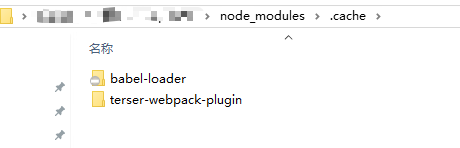
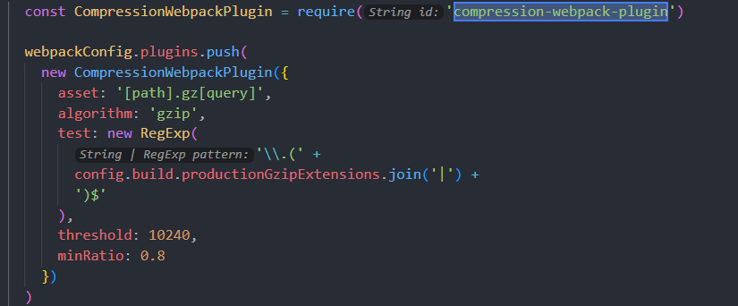
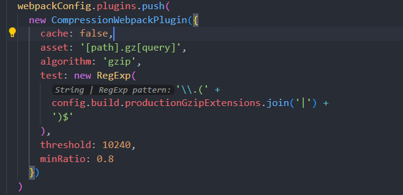

# 项目开发中node_modules包越来越大的问题🐱‍🏍🐱‍🏍🐱‍🏍

### 简介

这是关于我最近在开发一个旧项目时遇到的问题的记录。在开发过程中硬盘空间被占满了，其中`node_modules`占了惊人的`17G`。`省流可以直接查看第三节的问题解决方案`。由于我是在云端开发，无法复制代码，所以我将以图片形式展示。实际上需要修改的代码只有一行

### 一、问题缘由

- 项目是基于`PanJiaChen花裤衩`开源的`vue`后台项目模板改造的,这个项目模板对现在而言是比较老的了,但是很经典不少公司的中台项目都是基于这个改造的
- 在一次开发过程中，`win10`突然警告我磁盘空间不足。经过扫描发现项目占用了高达`18G`的空间。通过对文件的排查，我发现`node_modules`竟然占了`17G`一般来说，`node_moudules`的大小也就几百M，因此我怀疑是项目缓存导致的问题
- 通过对`node_moudules`里面文件分析发现`.cache`目录就是罪魁祸首

### 二、问题排查

- 通过删除`node_modules`重新下载发现只有几百兆的大小

- 每次修改完代码并重新编译运行或发布到测试环境后，`node_modules`都会增加几十甚至几百M

- 使用`pnpm`或者`yarn`来管理依赖和项目也不能解决该问题

- 最终，我通过对`node_modules`中的文件夹大小进行分析，发现了罪魁祸首——`.cache`文件夹

- 打开`.cache`目录我们可以看到以下目录

  

  

- 其中`babel-loader`是我们熟知的一个用于转译`ES6/ES7/JSX`语法到`ES5`的`Webpack`加载器,这个文件夹体积倒是不大,但是`terser-webpack-plugin`体积非常庞大,最终确定`node_moudules`体积越来越大的问题是由生成该文件的`Webpack`加载器导致的

### 三、问题解决(修改Webpack加载器配置)

- 在项目中找到了这个加载器的配置 `compression-webpack-plugin`

  

- **将该插件的缓存功能关闭(cache: false)**解决以上问题

  

  

### 最后

- 具体实现和项目代码Github  ☞ [jiuxiangyangguang/nestJs (github.com)](https://github.com/jiuxiangyangguang/nestJs)
- 还有一个基于最新React+Vite4.0开发的管理端项目  ☞ [jiuxiangyangguang/nestJs (github.com)](https://github.com/jiuxiangyangguang/nestJs)
- 如果这篇文章能为你提供帮助，那么请轻轻移动你的鼠标点亮`赞赏之星`，`关注`我的更新，并在`评论`区留下你的足迹😊
